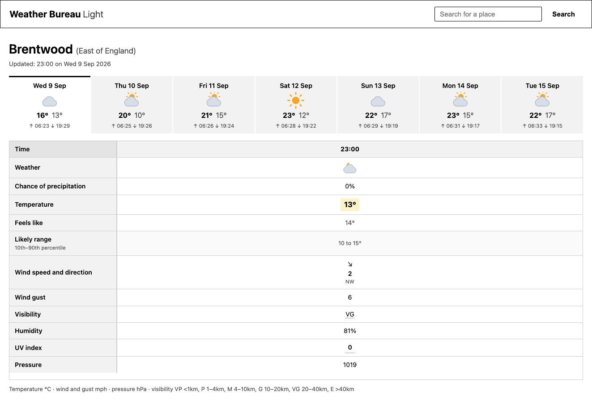

# Weather Bureau Light

Weather Bureau Light is a small local website for viewing dense Met Office forecasts
on a light background. It was built for people who find light text on a dark screen
difficult to read, and who prefer to see more forecast information at once.

The forecast includes a likely temperature range, showing the 10th to 90th percentile
of the Met Office's probabilistic forecast. It can also show Met Office Weather
Warnings that affect the selected forecast site.

This application is for personal, local use. The [Met Office terms of service][terms]
do not permit it to be run as a public instance.



## Setup

Create an account at [Met Office Weather DataHub](https://datahub.metoffice.gov.uk/)
and subscribe to the Site-Specific Blended Probabilistic Forecast API. The personal
plan allows up to 55 calls per day.

Install [uv](https://docs.astral.sh/uv/getting-started/installation/), then create your
environment file:

```sh
cp .env.example .env
```

Add your forecast API key to `METOFFICE_API_KEY` in `.env`. If you also have access to
the NSWWS Public API, add its key to `METOFFICE_NSWWS_API_KEY`; warnings are optional.

Install the dependencies:

```sh
uv sync
```

Start the site:

```sh
uv run weather-bureau-light
```

Open the address printed by the command (normally <http://127.0.0.1:5000/>).

To choose the site shown on the home page, set `WBL_DEFAULT_SITE` in `.env` to a place
name, postcode, or Met Office spot-site ID:

```dotenv
WBL_DEFAULT_SITE=Chelmsford
```

## When the API is unavailable

Forecast responses are cached under `.cache/`. If a request fails, the site serves the
most recent cached forecast and labels it as stale. Weather warnings fail closed: the
warnings section is omitted if the warnings API cannot be reached.

The health endpoint reports the state of the forecast API without making another API
request:

```sh
curl -sf http://127.0.0.1:5000/healthz || echo "forecast data is going stale"
```

It returns `200` while requests are succeeding and `503` after a request has failed.

## Development notes

The live forecast API currently uses these collections:

- `uk-spot-percentiles` for temperature, wind, humidity, visibility, UV, pressure and weather symbols.
- `uk-spot-probabilities` for the chance of precipitation.

Both collections are queried through an instance, for example:
`/collections/{id}/instances/blended/locations/{siteId}`.

The API key is sent in an `apikey` request header. The response is a
`CoverageCollection` containing a separate time axis for each parameter, so the
application merges values by timestamp.

The service declares its CoverageJSON axes in an order that does not match the order
used in its values. `covjson.choose_order` detects the actual layout from the data:
percentiles increase, while exceedance probabilities decrease.

The location catalogue contains IDs and coordinates but no names. Place searches use
[postcodes.io](https://postcodes.io), and the site name shown on the page comes from
reverse geocoding.

Parameter names are matched by pattern in `parameters.py` because the public glossary is
JavaScript-rendered and the API does not expose its definitions without authentication.
This lets an API rename affect one row rather than breaking the whole page.

Some fields are hourly (`Pt01h`) for the first part of the forecast and three-hourly
(`Pt03h`) later on. The finer resolution is used when both are available. The page
shows the first seven days because weather symbols stop being published after roughly
eight days even though some other fields continue for longer.

## Development commands

Run the test suite:

```sh
uv run pytest
```

Inspect the current API shape and save the responses under `scratch/discovery/`:

```sh
uv run python scripts/discover.py
```

Forecast and instance caches expire when the forecast rolls to a new hour. A five-minute
floor prevents a request made just before the hour from expiring immediately afterwards.
The site catalogue is cached for one week. Cache files record their own write time so a
copy or restored backup does not reset their age.

## Attribution

Forecast and warning data are © Crown copyright, Met Office. The page includes the
“Data supplied by the Met Office” acknowledgement required by the DataHub terms. The
weather symbols were created for this project and do not use the Met Office's artwork.

[terms]: https://www.metoffice.gov.uk/binaries/content/assets/metofficegovuk/pdf/data/met-office-weatherdatahub-terms-and-conditions.pdf
